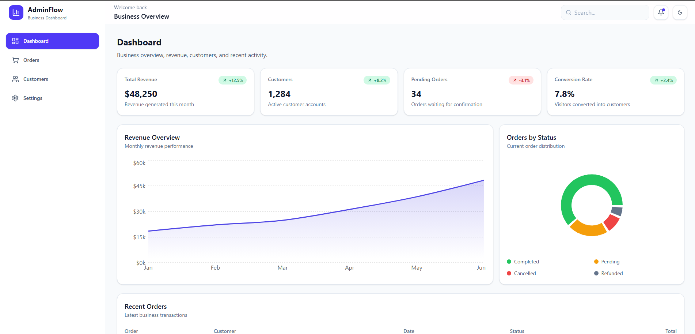
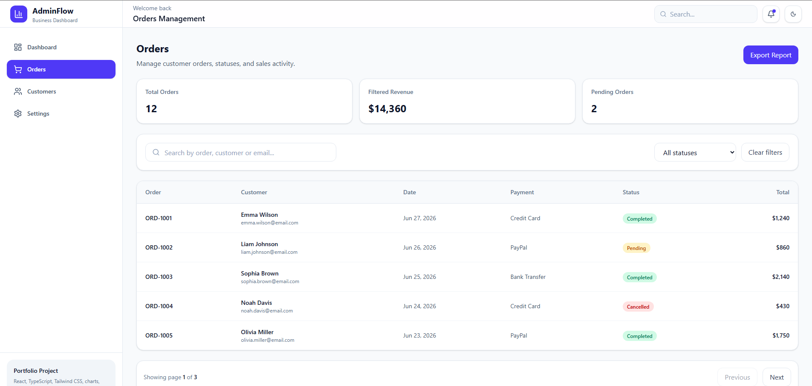
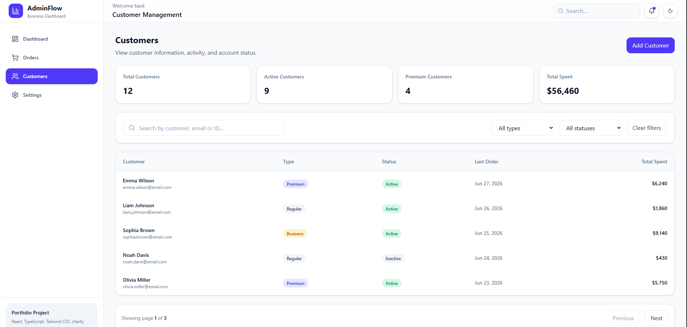
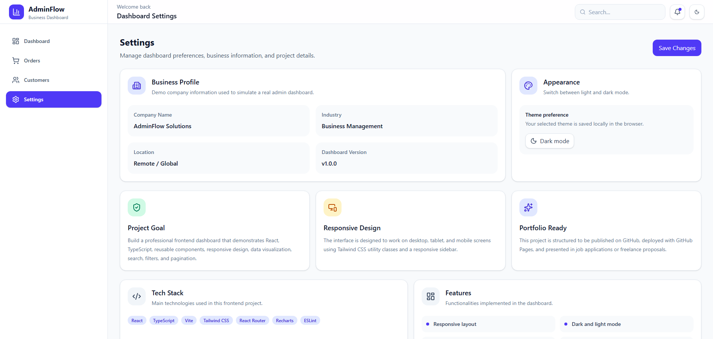
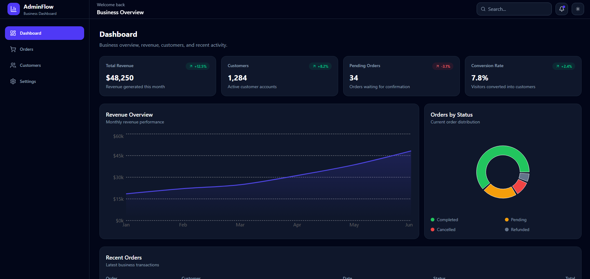
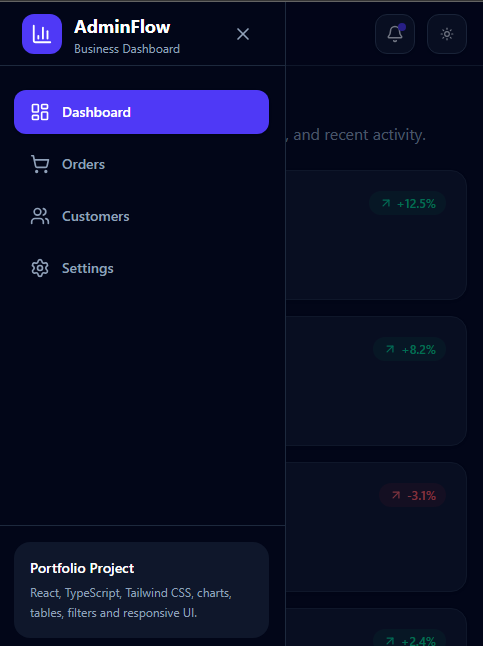

# AdminFlow - Business Admin Dashboard

AdminFlow is a modern, responsive business admin dashboard built with React, TypeScript, Tailwind CSS, React Router, and Recharts.

The project simulates a real business management dashboard where users can review revenue, customers, orders, charts, filters, pagination, and dashboard settings.

## Live Demo

https://jasonfuentess.github.io/business-admin-dashboard/

## Repository

https://github.com/Jasonfuentess/business-admin-dashboard

## Preview
### Dashboard

### Orders Page

### Customers Page

### Settings Page

### Dark Mode

### Mobile Side Bar

## Features

Responsive dashboard layout
Dark and light mode
Sidebar navigation
KPI summary cards
Revenue chart
Orders by status chart
Recent orders table
Orders management page
Customers management page
Search by order, customer, email, or ID
Filter by order status
Filter by customer type and status
Pagination
Empty states
Settings page
Reusable UI components
Typed mock data with TypeScript
Production build with Vite
GitHub Pages deployment
Tech Stack
React
TypeScript
Vite
Tailwind CSS
React Router DOM
Recharts
Lucide React
ESLint
GitHub Pages

## Pages
## Dashboard

The dashboard page displays business KPIs, revenue performance, order status distribution, and recent orders.

## Orders

The orders page includes searchable and filterable order data with pagination and status badges.

## Customers

The customers page includes customer information, customer type filters, status filters, pagination, and total spending summaries.

## Settings

The settings page includes business profile information, theme preferences, project details, tech stack, features, and future improvements.

## What I Built

This project was built to demonstrate frontend development skills using a realistic business dashboard scenario.

## The main focus areas were:

Component-based architecture
Type-safe data models
Clean folder structure
Responsive layout
Dashboard UI design
Data visualization
Search and filter logic
Pagination logic
Dark and light theme handling
Deployment using GitHub Pages

## How to Run Locally

### Clone the repository:

git clone https://github.com/TU-USUARIO/business-admin-dashboard.git

### Go to the project folder:

cd business-admin-dashboard

### Install dependencies:

npm install

### Run the development server:

npm run dev

### Run lint:

npm run lint

### Create a production build:

npm run build

### Preview the production build:

npm run preview

## Deployment

This project is deployed using GitHub Pages.

### To deploy:

npm run deploy

## Future Improvements

Connect the dashboard to an ASP.NET Core Web API
Add real authentication with JWT
Add user roles
Connect to SQL Server or PostgreSQL
Add create, update, and delete functionality
Add unit tests
Add export to CSV
Add real API loading states

## Author

Jason Fuentes

Full-Stack Developer